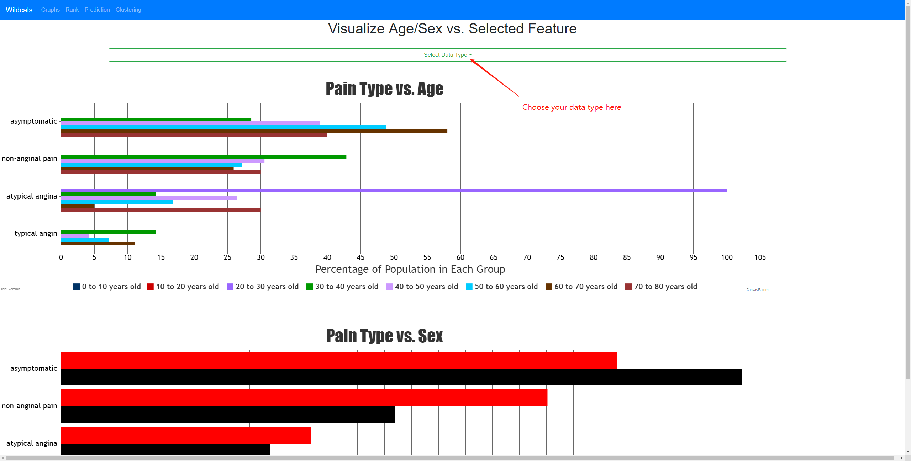
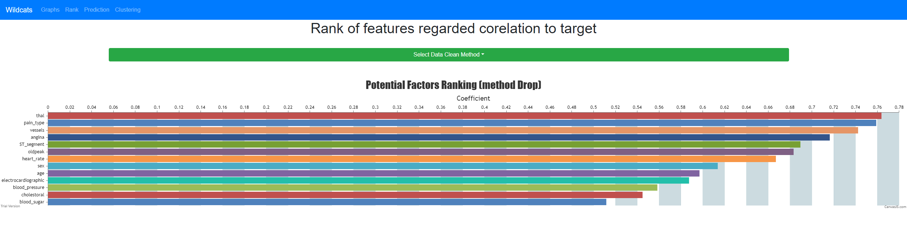
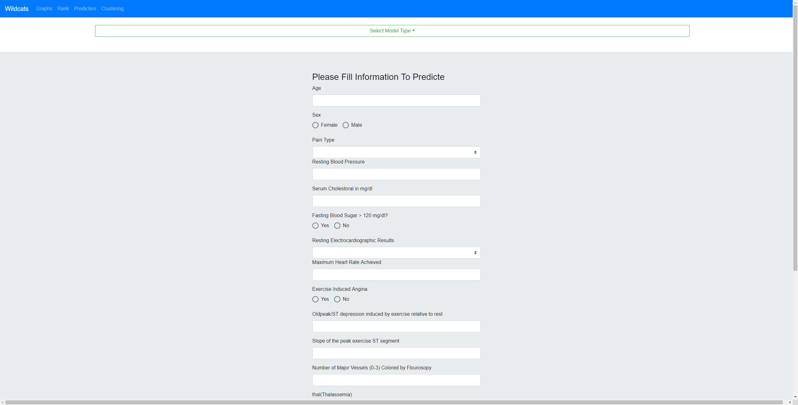
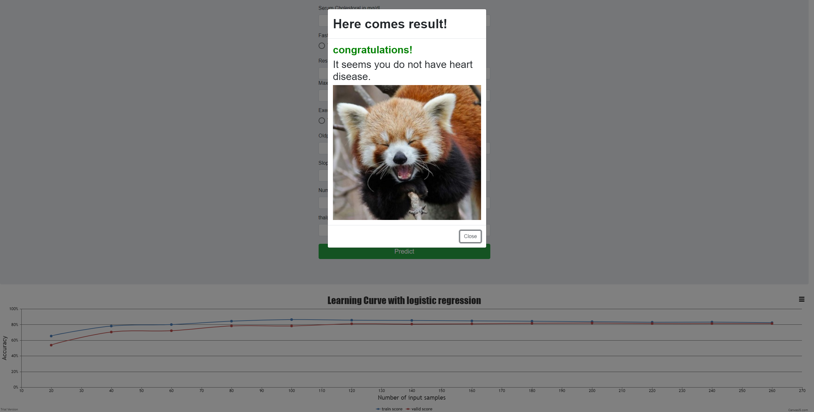
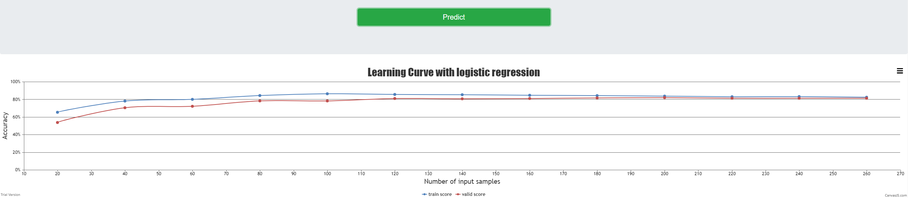
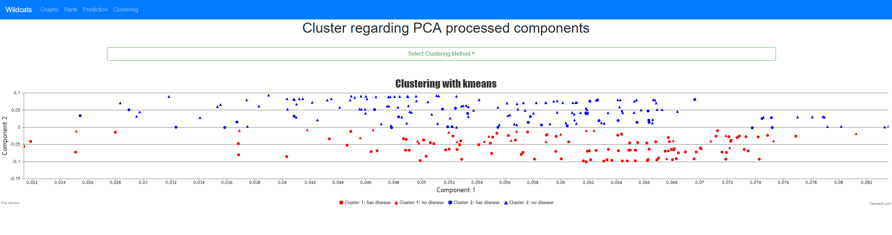

# Heart Disease Data Analysis
## 1. Enviornment Install
Make sure you have node.js and Python 3 installed already, pip3 is nessesary as well, recommend pip3 > 19.0.0<br />
You can download node.js at https://nodejs.org/en/, python 3 at https://www.python.org/downloads/.<br />
Our back-end developed using Flask, before install all requirements, you can upgrade you pip by run in you terminal
```
pip3 install --upgrade pip
```
Install back-end enviornment by run
```
pip3 install -r service/requirements.txt
```
Front-end of this site developed using Angular 7. To install angular 7, make sure your node.js installation is finished<br />
You can install angular 7 by command following in your terminal
```
npm install -g @angular/cli
```
We also use bootstrap to pretty our site, to install boostrap, you can run
```
npm install --save @ng-bootstrap/ng-bootstrap
```
then install material for angular form
```
npm install --save @angular/material @angular/cdk @angular/animations
```

## 2. Run on your localhost
Our front-end and back-end are running in separate services.<br />
To run back-end, type this command in your terminal
```
python3 service/src/__init__.py
```
note: if you pointed python3 to command "python", most Windows enviornment does, you should use python instead of python3<br />
To run front-end, go to directory frontend by
```
cd frontend
```
Then type this command in your terminal to start service
```
ng serve
```
With both front-end and back-end services opened, you can open front-end page by
```
http://127.0.0.1:4200
```
to check back-end api documents
```
http://127.0.0.1:5000/api 
```

## 3. Fill database
In order to present better performance to user experience, our sturcture intended to stored processed data into database. So you may always want to fill prepared data into database before interact with front-end UI.

This figure shows all APIs that this service have.<br />
### 3.1 Create Database and tables with filling raw data into tables
```
http://127.0.0.1:5000/api/writeDB
```
### 3.2 Process data engineering to save cleaned data into database
```
http://127.0.0.1:5000/api/saveCleanDataDB
```
note: you can choose clean method to dirty data (defult is drop lines that contains dirty data)<br />
mothods options: 1. drop 2. knn
```
http://127.0.0.1:5000/api/saveCleanDataDB?method=knn
```
Above is an example of using knn prediction to clean dirty data (You always have to save both drop and knn methods at least once for futrue use such as ranking and prediction)
### 3.3 Save feature ranking to database (You always have to save both drop and knn methods in order to choose ranking methods in front-end.)
```
http://127.0.0.1:5000/api/rankFeature_toDB
```
save knn clean method to db:
```
http://127.0.0.1:5000/api/rankFeature_toDB?method=knn
```
You can choose methods between drop and knn too
### 3.4 Trainning and save model
Model will be saved as .sav, model name depends on prediction type
```
http://127.0.0.1:5000/api/saveModels
```
note: You can choose data clean methods same as above<br />
besides, you can choose model type with options:(default is stack)<br />
1. logit<br />
2. stack<br />
An example with choose drop as method and logit as trainning type (You always have to train both logit and stack methods in order to choose prdiction methods in front-end.)

```
http://127.0.0.1:5000/api/saveModels?method=drop&model_type=logit
```
then stack model type
```
http://127.0.0.1:5000/api/saveModels?method=drop&model_type=stack
```
### 3.5 Save learning curve
Save logit method learning curve regarding number of samples
```
http://127.0.0.1:5000/api/saveLearningCurve?model_type=logit
```
Save stacked method learning curve
```
http://127.0.0.1:5000/api/saveLearningCurve?model_type=stack
```
## 4. Time to play
open UI page with
```
http://127.0.0.1:4200
```

You can click showgraph on navigation bar, then choose data type to visualize each graph/diagram

You can click rank and choose ranking method to visualize ranking of features

You can click predition, choose predition model and fill information (none of them are required) then click submission button to predict

Result will pop up after you predict

You can see learning curve below regarding your prediction method

You can clice clustering on navigation bar and choose clustering type to visualize clustering data graph

Have fun!
