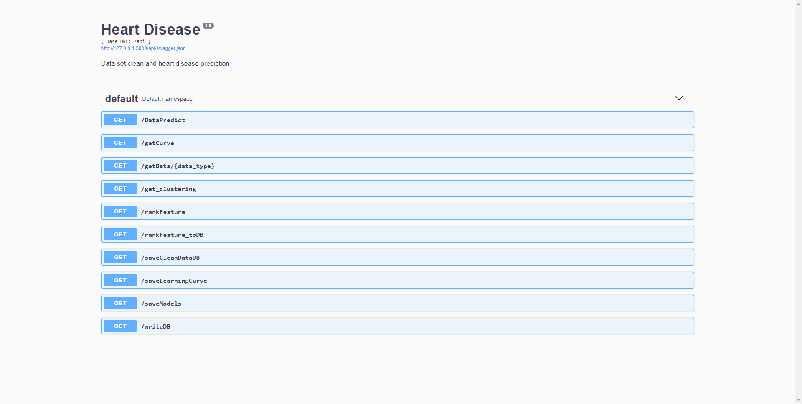

# Heart Disease Data Analysis
## 1. Enviornment Install
Make sure you have node.js and Python 3 installed already, pip3 is nessesary as well, recommend pip3 > 19.0.0
You can download node.js at https://nodejs.org/en/, python 3 at https://www.python.org/downloads/.
Our back-end developed using Flask, before install all requirements, you can upgrade you pip by run in you terminal
```
pip3 install --upgrade pip
```
Install back-end enviornment by run
```
pip3 install -r service/requirements.txt
```
Front-end of this site developed using Angular 7. To install angular 7, make sure your node.js installation is finished
You can install angular 7 by command following in your terminal
```
npm install -g @angular/cli
```
We also use bootstrap to pretty our site, to install boostrap, you can run
```
npm install --save @ng-bootstrap/ng-bootstrap
```
then install material for angular form
```
npm install --save @angular/material @angular/cdk @angular/animations
```

## 2. Run on your localhost
Our front-end and back-end are running in separate services.
To run back-end, type this command in your terminal
```
python3 service/src/__init__.py
```
note: if you pointed python3 to command "python", most Windows enviornment does, you should use python instead of python3
To run front-end, go to directory frontend by
```
cd frontend
```
Then type this command in your terminal to start service
```
ng serve
```
With both front-end and back-end services opened, you can go to http://127.0.0.1:4200 for front-end page and http://127.0.0.1:5000/api to check back-end api documents.

## 3. Fill database
In order to present better performance to user experience, our sturcture intended to stored processed data into database. So you may always want to fill prepared data into database before interact with front-end UI.

This figure shows all APIs that this service have.
